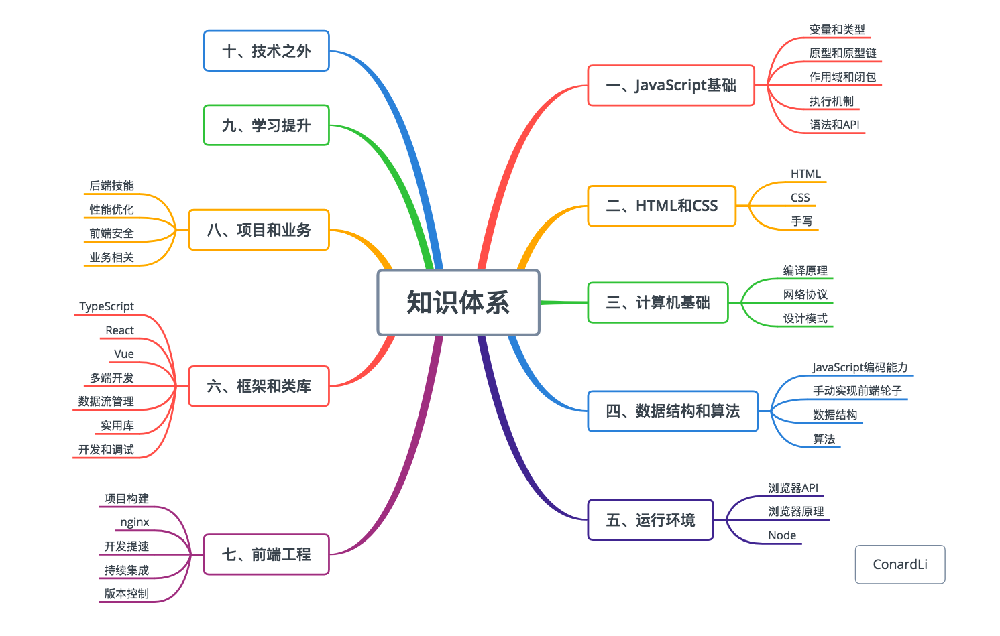
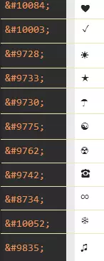

# 前端知识体系结构图 #




 # 1  快捷键 #
 <table>
   <tr>
     <th>功能</th>
     <th>快捷键</th>
   </tr>
   <tr>
    <td>加粗</td>
    <td>Ctrl + B</td>
   </tr>
   <tr>
    <td>斜体</td>
    <td>Ctrl + I</td>
   </tr>
   <tr>
    <td>引用</td>
    <td>Ctrl + Q</td>
   </tr>
   <tr>
    <td>插入链接</td>
    <td>Ctrl + L</td>
   </tr>
   <tr>
    <td>插入代码</td>
    <td>Ctrl + K</td>
   </tr>
   <tr>
    <td>插入图片</td>
    <td>Ctrl + G</td>
   </tr>
   <tr>
    <td>提升标题</td>
    <td>Ctrl + H</td>
   </tr>
   <tr>
    <td>有序列表</td>
    <td>Ctrl + O</td>
   </tr>
   <tr>
    <td>无序列表</td>
    <td>Ctrl + U</td>
   </tr>
   <tr>
    <td>横线</td>
    <td>Ctrl + R</td>
   </tr>
   <tr>
    <td>撤销</td>
    <td>Ctrl + Z</td>
   </tr>
   <tr>
    <td>重做</td>
    <td>Ctrl + Y</td>
   </tr>
 </table>
 
 # 2 基本语法 #
## 2.1 字体设置 ##
 斜体:  
 描述|效果
 -|-
 `*斜体*`|*斜体*
`_斜体_`|_斜体_
`**加粗**`|**加粗**
`***倾斜加粗***`|***倾斜加粗***
`~~删除线~~`|~~删除线~~

## 2.2 标题 ##
`# 一级标题 #`
# 一级标题 #<br>
`## 二级标题 ##`
## 二级标题 ##<br>
`### 三级标题 ###`
### 三级标题 ###<br>
`#### 四级标题 ####`
#### 四级标题 ####<br>
`##### 五级标题 ######`
##### 五级标题 ######<br>
`###### 六级标题 ######`
###### 六级标题 ######<br>

## 2.3 链接 ##
### 2.3.1图片链接 ###
``
### 2.3.2直链接 ###
`<https://www.baidu.com>`<br>
<https://www.baidu.com>

## 2.4 分割线 ##
`*********`
*********

## 2.5 代码块 ##
```
const main = () => console.log()
```
行内块：`console.log()`

## 2.6 引用 ##
`> 引用`
> 引用

`> 连续引用`
> 引用 
> 
> 引用

`>>嵌套引用`
>>>嵌套引用<br>

>>嵌套引用<br>

>嵌套引用

## 2.7 列表 ##
### 2.7.1 无序列表 ###
`-无序`
- 无序
- 无序
- 无序

`*无序`
* 无序
* 无序
* 无序

`+无序`
+ 无序
+ 无序
+ 无序

### 2.7.2 有序列表 ###
`1. 有序`
1. 有序
2. 有序
3. 有序

## 2.8 表格 ##
### 基础 ###
```
id|name|sex
-|-|-
1|2|3
```
id|name|sex
-|-|-
1|2|3

### :表示左右对齐 ###
```
id|name|sex
-|:-:|-
1|2|3
```
id|name|sex
-|:-:|-:
1|2|3

# 3. 常用技巧 #
## 3.1 换行 ##
1. 连续两个以上空格+回车  
2. 使用html语言换行标签   

## 3.2 其他特殊字符，示例如下(其他实例：<https://unicode-table.com/cn/>)： ##
  

