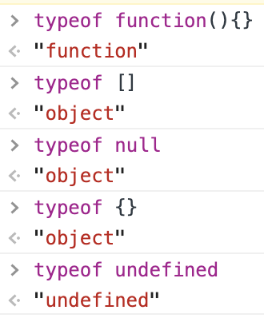

# JavaScript基础 #

## 1.JavaScript规定了几种语言类型(2019/10/21) ##

1. 基本数据类型
    - Number
    - String
    - Boolean
    - Undefined
    - Null

2. 复杂数据类型
    - Object
    - Function
    - Symbol

3. 验证数据类型之`typeof`字符中比较特殊的情况  
    

4. 判断常用if()中的值会自动调用Boolean()方法，所以会有以下经常判断的方法(`非常重要`)：  

数据类型|转化为true的值|转化为false的值
-|:-:|:-:
Boolean|true|false
String|任何非空字符串|“”(空字符串)
Number|任何非0数字(包括无穷大)|0和NaN
object|任何对象(包括数组等)|null
Undefined|N/A(not applicable不适用)|undefined

5. 最稳定的验证数据类型的方法，利用原型来验证
```
function(value){
  return Object.prototype.toString.call(value).slice(8, -1)
}
// return 'String', 'Null', 'Object'等
```

6. 最新的数据类型之Symbol  
> 表示独一无二的值，它是一切非字符串的对象key的集合。 Symbol 值通过Symbol函数生成。这就是说，对象的属性名现在可以有两种类型，一种是原来就有的字符串，另一种就是新增的 Symbol 类型。凡是属性名属于 Symbol 类型，就都是独一无二的，可以保证不会与其他属性名产生冲突。 Symbol函数可以接受一个字符串作为参数，表示对 Symbol 实例的描述，但是即使描述相同，Symbol值也不相等。
```
 var a = Symbol('1');
 var b = Symbol('2');
 a === b; // false
```
**********
# 3.Symbol类型在实际开发中的应用、可手动实现一个简单的Symbol(2019/10/22) #

 ## 3.1 概述 ##
- Symbol()是唯一值  
- 可传一个字符串，如：Symbol('foo'),但是Symbol('foo') !== Symbol('foo')
- 如果 Symbol 的参数是一个对象，就会调用该对象的toString方法，将其转为字符串，然后才生成一个 Symbol 值。
```
const obj = {
  toString() {
    return 'abc';
  }
};
const sym = Symbol(obj);
sym // Symbol(abc)
```
- 可以转化为字符串
```
let sym = Symbol('My symbol');

String(sym) // 'Symbol(My symbol)'
sym.toString() // 'Symbol(My symbol)'
```
- 不能做运算，会抛出错误

## 3.2 Symbol.prototype.description 获取一个symbol对象的描述 ##
```
const sym = Symbol('foo')
sym.description // "foo"
```

## 3.3 作为属性的Symbol ##
1. 不能使用点运算符
```
  const sym = Symbol()
  const a = {}
  
  a.sym = 'hello'; // 其实是给a对象定义了一个字符串sym作为属性，而不是Symbol()生成的不可变的值
  a[sym] = 'hello' // 正确使用方式
```
2. 在对象中定义属性的时候需要用[]包起来
  ```
  const sym = Symbol()
  const a = {
      [sym](...arg){
          // do something
      }
  }

  a[sym](123) // amazing!!!
  ```

3. 定义常量
```
const COLOR_RED    = Symbol();
const COLOR_GREEN  = Symbol();

function getComplement(color) {
  switch (color) {
    case COLOR_RED:
      return COLOR_GREEN;
    case COLOR_GREEN:
      return COLOR_RED;
    default:
      throw new Error('Undefined color');
    }
}
```

## 3.4 属性名的遍历 ##
> 1. Reflect.ownKeys  可以返回一个对象中的所有的Symbol和非Symbol的键名  
> 2. Object.getOwnPropertyNames 返回非Symbol的键名  
> 3. Object.getOwnPropertySymbols 只返回Symbol的键名
```
const sym = Symbol('foo')
const obj = {
    [sym]: 1,
    symStr: 2
}
Reflect.ownKeys(obj)                // ["symStr", Symbol(foo)]
Object.getOwnPropertyNames(obj)     // ["symStr"]
Object.getOwnPropertySymbols(obj)   // Symbol(foo)]
```

## 3.5 Symbol.for() 和 Symbol.keyfor() ##
1. Symbol.for 和Symbol的区别：
> Symbol.for()与Symbol()这两种写法，都会生成新的 Symbol。它们的区别是，前者会被登记在全局环境中供搜索，后者不会。Symbol.for()不会每次调用就返回一个新的 Symbol 类型的值，而是会先检查给定的key是否已经存在，如果不存在才会新建一个值。比如，如果你调用Symbol.for("cat")30 次，每次都会返回同一个 Symbol 值，但是调用Symbol("cat")30 次，会返回 30 个不同的 Symbol 值。  
```
 Symbol.for("bar") === Symbol.for("bar")
 // true

 Symbol("bar") === Symbol("bar")
 // false

 由于Symbol.for有登记机制所以symbol.for能找到，但是symbol却不能找到

 let s1 = Symbol.for("foo");
 Symbol.keyFor(s1) // "foo"
 
 let s2 = Symbol("foo");
 Symbol.keyFor(s2) // undefined
```