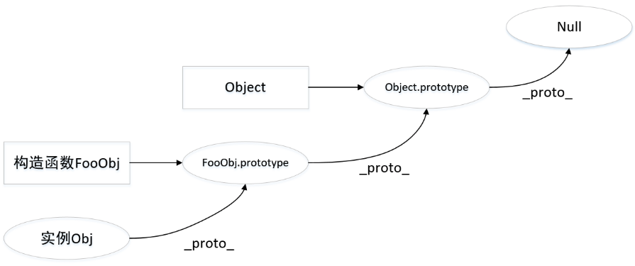

# 原型和原型链 #
## 1. 理解原型设计模式以及JavaScript中的原型规则 ##
### 原型规则 ###  
- 所有的引用类型（数组、对象、函数），都具有对象特征，即可自由扩展属性；
- 所有的引用类型，都有一个_proto_ 属性（隐式原型），属性值是一个普通对象；
- 所有函数，都具有一个prototype（显示原型），属性值也是一个普通原型；
- 所有的引用类型（数组、对象、函数），其隐式原型指向其构造函数的显式原型；（obj.proto === Object.prototype）；
- 当试图得到一个对象的某个属性时，如果这个对象本身没有这个属性，那么会去它的_proto_（即它的构造函数的prototype）中去寻找；
### 原型对象 ###
prototype在js中，函数对象其中一个属性：原型对象prototype。普通对象没有prototype属性，但有_proto_属性。
原型的作用就是给这个类的每一个对象都添加一个统一的方法，在原型中定义的方法和属性都是被所以实例对象所共享。
```
var person = function(name){
    this.name = name
};
person.prototype.getName=function(){//通过person.prototype设置函数对象属性
    return this.name; 
}
var crazy= new person(‘crazyLee’);
crazy.getName(); //crazyLee//crazy继承上属性
```
```
const cc = function(){}
const aa = new cc()
aa.__proto__ === cc.prototype // true
```
### 原型链 ###
当试图得到一个对象f的某个属性时，如果这个对象本身没有这个属性，那么会去它的_proto_（即它的构造函数的prototype）obj._proto_中去寻找；当obj._proto也没有时，便会在obj._proto.proto（即obj的构造函数的prototype的构造函数的prototype）中寻找；  


###  设计模式 ###
1. 工厂模式
> 在函数内创建一个对象，给对象赋予属性及方法再将对象返回
```
function Person() {
	var People = new Object();
	People.name = 'CrazyLee';
	People.age = '25';
	People.sex = function(){
		return 'boy';
	};
	return People;
}

var a = Person();
console.log(a.name);//CrazyLee
console.log(a.sex());//boy
```
2. 构造函数模式  
> 无需在函数内部重新创建对象，而是用this指代
```
function Person() {
	this.name = 'CrazyLee';
	this.age = '25';
	this.sex = function(){
		return 'boy'
	};
	
}

var a = new Person();
console.log(a.name);//CrazyLee
console.log(a.sex());//boy
```
3. 原型模式  
> 函数中不对属性进行定义，利用prototype属性对属性进行定义，可以让所有对象实例共享它所包含的属性及方法。
```
function Parent() {
	Parent.prototype.name = 'carzy';
	Parent.prototype.age = '24';
	Parent.prototype.sex = function() {
	&emsp;var s="女";

&emsp;&emsp;&emsp; console.log(s);
	}
}

var  x =new  Parent();  
console.log(x.name);      //crazy
console.log(x.sex());       //女
```
4. 混合模式  
> 原型模式+构造函数模式。这种模式中，构造函数模式用于定义实例属性，而原型模式用于定义方法和共享属性
```
function Parent(){  
	this.name="CrazyLee";  
	this.age=24;  
};
Parent.prototype.sayname=function(){  
	return this.name;  
};

var x =new Parent(); 
console.log(x.sayname());   //Crazy&emsp;&emsp;
```
5. 动态原型模式
> 将所有信息封装在了构造函数中，而通过构造函数中初始化原型，这个可以通过判断该方法是否有效而选择是否需要初始化原型。
```
function Parent(){  
	this.name="CrazyLee";  
	this.age=24;  
	if(typeof Parent._sayname=="undefined"){     
		Parent.prototype.sayname=function(){  
			return this.name;  
		}  
		Parent._sayname=true;  
	}         
};   

var x =new Parent();  
console.log(x.sayname()); 
```
## 2. instanceof的底层实现原理，手动实现一个instanceof ##


## 3. 实现继承的几种方式以及他们的优缺点 ##


## 4. 至少说出一种开源项目(如Node)中应用原型继承的案例 ##


## 5. 可以描述new一个对象的详细过程，手动实现一个new操作符 ##


## 6. 理解es6 class构造以及继承的底层实现原理 ##