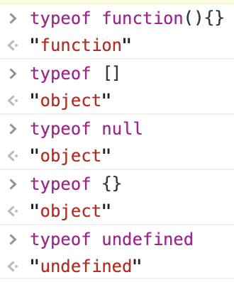
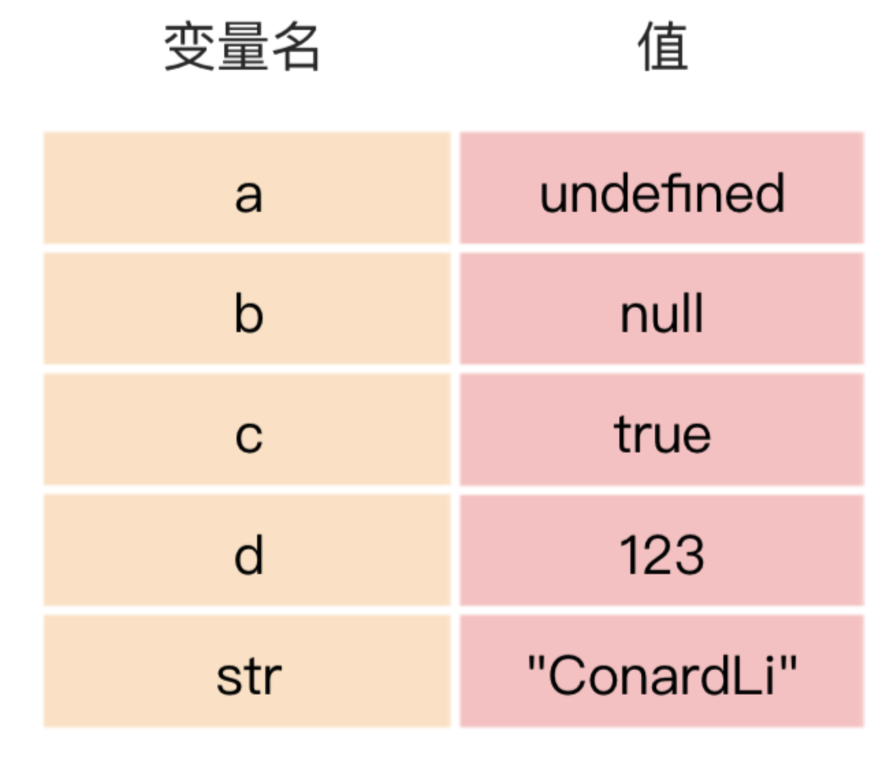
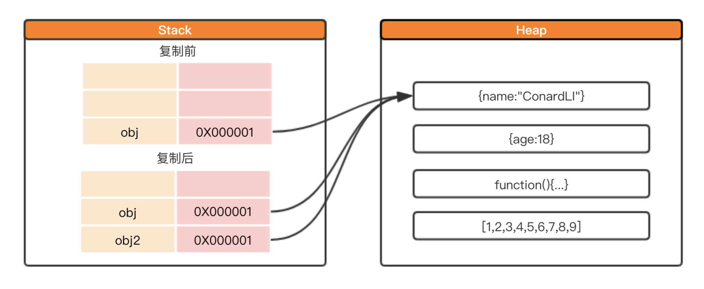
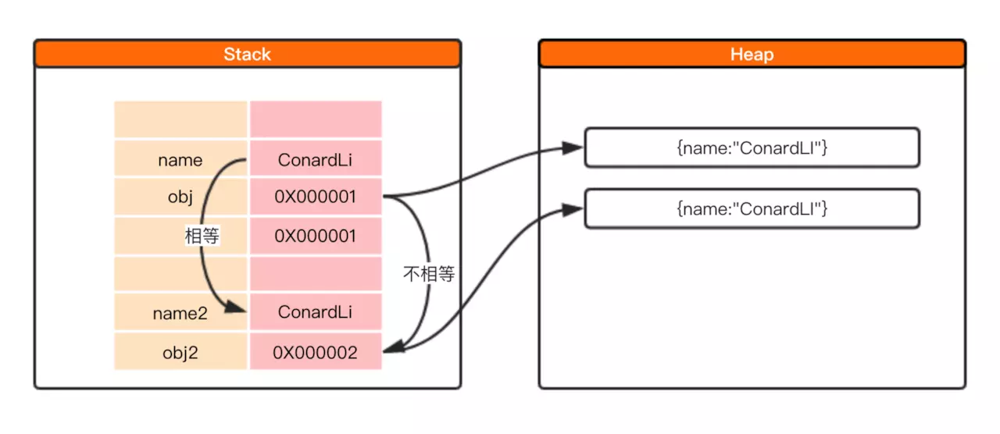
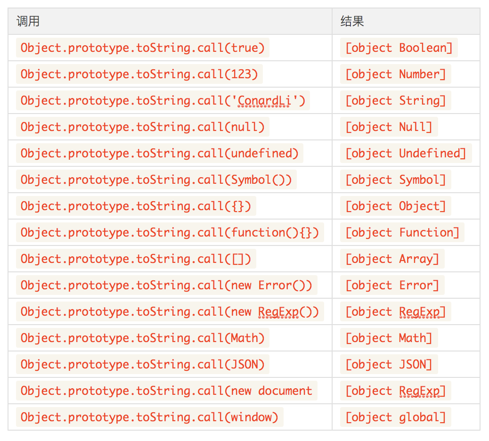

# 变量和类型 #

## 1.JavaScript规定了几种语言类型(2019/10/21) ##

1. 基本数据类型
    - Number
    - String
    - Boolean
    - Undefined
    - Null
    - Symbol
    - BigInt(Es10加入)

2. 复杂数据类型
    - Object  
    1. Array 数组
    2. Date 日期
    3. RegExp 正则
    4. Function 函数

3. 验证数据类型之`typeof`字符中比较特殊的情况  
    

4. 判断常用if()中的值会自动调用Boolean()方法，所以会有以下经常判断的方法(`非常重要`)：  

数据类型|转化为true的值|转化为false的值
-|:-:|:-:
Boolean|true|false
String|任何非空字符串|“”(空字符串)
Number|任何非0数字(包括无穷大)|0和NaN
object|任何对象(包括数组等)|null
Undefined|N/A(not applicable不适用)|undefined

5. 最稳定的验证数据类型的方法，利用原型来验证
```
function(value){
  return Object.prototype.toString.call(value).slice(8, -1)
}
// return 'String', 'Null', 'Object'等
```

6. 最新的数据类型之Symbol  
> 表示独一无二的值，它是一切非字符串的对象key的集合。 Symbol 值通过Symbol函数生成。这就是说，对象的属性名现在可以有两种类型，一种是原来就有的字符串，另一种就是新增的 Symbol 类型。凡是属性名属于 Symbol 类型，就都是独一无二的，可以保证不会与其他属性名产生冲突。 Symbol函数可以接受一个字符串作为参数，表示对 Symbol 实例的描述，但是即使描述相同，Symbol值也不相等。
```
 var a = Symbol('1');
 var b = Symbol('2');
 a === b; // false
```
**********
# 3.Symbol类型在实际开发中的应用、可手动实现一个简单的Symbol(2019/10/22) #

 ## 3.1 概述 ##
- Symbol()是唯一值  
- 可传一个字符串，如：Symbol('foo'),但是Symbol('foo') !== Symbol('foo')
- 如果 Symbol 的参数是一个对象，就会调用该对象的toString方法，将其转为字符串，然后才生成一个 Symbol 值。
```
const obj = {
  toString() {
    return 'abc';
  }
};
const sym = Symbol(obj);
sym // Symbol(abc)
```
- 可以转化为字符串
```
let sym = Symbol('My symbol');

String(sym) // 'Symbol(My symbol)'
sym.toString() // 'Symbol(My symbol)'
```
- 不能做运算，会抛出错误

## 3.2 Symbol.prototype.description 获取一个symbol对象的描述 ##
```
const sym = Symbol('foo')
sym.description // "foo"
```

## 3.3 作为属性的Symbol ##
1. 不能使用点运算符
```
  const sym = Symbol()
  const a = {}
  
  a.sym = 'hello'; // 其实是给a对象定义了一个字符串sym作为属性，而不是Symbol()生成的不可变的值
  a[sym] = 'hello' // 正确使用方式
```
2. 在对象中定义属性的时候需要用[]包起来
  ```
  const sym = Symbol()
  const a = {
      [sym](...arg){
          // do something
      }
  }

  a[sym](123) // amazing!!!
  ```

3. 定义常量
```
const COLOR_RED    = Symbol();
const COLOR_GREEN  = Symbol();

function getComplement(color) {
  switch (color) {
    case COLOR_RED:
      return COLOR_GREEN;
    case COLOR_GREEN:
      return COLOR_RED;
    default:
      throw new Error('Undefined color');
    }
}
```

## 3.4 属性名的遍历 ##
> 1. Reflect.ownKeys  可以返回一个对象中的所有的Symbol和非Symbol的键名  
> 2. Object.getOwnPropertyNames 返回非Symbol的键名  
> 3. Object.getOwnPropertySymbols 只返回Symbol的键名
```
const sym = Symbol('foo')
const obj = {
    [sym]: 1,
    symStr: 2
}
Reflect.ownKeys(obj)                // ["symStr", Symbol(foo)]
Object.getOwnPropertyNames(obj)     // ["symStr"]
Object.getOwnPropertySymbols(obj)   // Symbol(foo)]
```

## 3.5 Symbol.for() 和 Symbol.keyfor() ##
1. Symbol.for 和Symbol的区别：
> Symbol.for()与Symbol()这两种写法，都会生成新的 Symbol。它们的区别是，前者会被登记在全局环境中供搜索，后者不会。Symbol.for()不会每次调用就返回一个新的 Symbol 类型的值，而是会先检查给定的key是否已经存在，如果不存在才会新建一个值。比如，如果你调用Symbol.for("cat")30 次，每次都会返回同一个 Symbol 值，但是调用Symbol("cat")30 次，会返回 30 个不同的 Symbol 值。  
```
 Symbol.for("bar") === Symbol.for("bar")
 // true

 Symbol("bar") === Symbol("bar")
 // false

 由于Symbol.for有登记机制所以symbol.for能找到，但是symbol却不能找到

 let s1 = Symbol.for("foo");
 Symbol.keyFor(s1) // "foo"
 
 let s2 = Symbol("foo");
 Symbol.keyFor(s2) // undefined
```

## 3.6 Symbol.hasInstance  ##
> 当其他对象使用instanceof运算符，判断是否为该对象的实例时，会调用这个方法。比如，foo instanceof Foo在语言内部，实际调用的是Foo\[Symbol.hasInstance](foo)
```
  class Even {
      [Symbol.hasInstance](obj) {
          return obj instanceof Array
      }
  }

  [1,2] instanceof new Even    // true

  eg:
  const Odd = {
      [Symbol.hasInstance](obj) {
          return Number(obj) % 2 === 0
      }
  }

  1 instanceof Odd          //  false
  2 instanceof Odd          //  true
```

## 3.7 Symbol.isConcatSpreadable 设置使数组是否展开 ##
> isConcatSpreadable如果为false，则concat不会去展开，会true则会展开
```
let arr1 = [1,2]
arr1[SymbolisConcatSpreadable] = false
[4,5].concat(arr1)  //  [4, 5, Array(2)]
```

## 3.8 Symbol.speice ##
> 有些类库是在基类的基础上修改的，那么子类使用继承的方法时，作者可能希望返回基类的实例，而不是子类的实例  
```
class T1 extends Promise {
}

class T2 extends Promise {
  static get [Symbol.species]() {
    return Promise;
  }
}

new T1(r => r()).then(v => v) instanceof T1 // true
new T2(r => r()).then(v => v) instanceof T2 // false
```

## 3.9 Symbol.iterator  ##
> 对象的Symbol.iterator属性，指向该对象的默认遍历器方法。
```
const myIterable = {};
myIterable[Symbol.iterator] = function* () {
  yield 1;
  yield 2;
  yield 3;
};

[...myIterable] // [1, 2, 3]
```
> for of 循环
```
class Collection {
  *[Symbol.iterator]() {
    let i = 0;
    while(this[i] !== undefined) {
      yield this[i];
      ++i;
    }
  }
}

let myCollection = new Collection();
myCollection[0] = 1;
myCollection[1] = 2;

for(let value of myCollection) {
  console.log(value);
}
// 1
// 2
```

## 3.10 Symbol总结 ##
Symbol方法|调用时机
-|-
Symbol.hasInstance|instanceof
Symbol.isConcatSpreadable|Array.prototype.concat()
Symbol.species|创建衍生对象时，会使用该属性
Symbol.match|str.match(myObject)
Symbol.replace|String.prototype.replace
Symbol.search|String.prototype.search
Symbol.split|String.prototype.split
Symbol.iterator|指向该对象的默认遍历器方法
Symbol.toStringTag|Object.prototype.toString
Symbol.toPrimitive|该对象被转为原始类型的值时，会调用这个方法，返回该对象对应的原始类型值

Symbol.toPrimitive被调用时，会接受一个字符串参数，表示当前运算的模式，一共有三种模式。
- Number：该场合需要转成数值
- String：该场合需要转成字符串
- Default：该场合可以转成数值，也可以转成字符串

# 4.JavaScript中的变量在内存中的具体存储形式 (10/25/2019)#
> 基本数据类型和引用数据类型的区别。
在JavaScript中，每一个变量在内存中都需要一个空间来存储。
内存空间又被分为两种，栈内存与堆内存。
1. 栈内存
  - 存储的值大小固定
  - 空间较小
  - 可以直接操作其保存的变量，运行效率高
  - 由系统自动分配存储空间
  - 具有不可变性
  > JavaScript中的原始类型的值被直接存储在栈中，在变量定义时，栈就为其分配好了内存空间。

  
> 由于栈中的内存空间的大小是固定的，那么注定了存储在栈中的变量就是不可变的。
在上面的代码中，我们执行了str += '6'的操作，实际上是在栈中又开辟了一块内存空间用于存储'ConardLi6'，然后将变量str指向这块空间，所以这并不违背不可变性的特点。

2. 堆存储  
- 存储的值大小不定，可动态调整
- 空间较大，运行效率低
- 无法直接操作其内部存储，使用引用地址读取
- 通过代码进行分配空间
- 具有可变性
> 相对于上面具有不可变性的原始类型，我习惯把对象称为引用类型，引用类型的值实际存储在堆内存中，它在栈中只存储了一个固定长度的地址，这个地址指向堆内存中的值。
```
var obj1 = {name:"ConardLi"}
var obj2 = {age:18}
var obj3 = function(){...}
var obj4 = [1,2,3,4,5,6,7,8,9]
```


3. 比较复制
> - 基本引用类型复制后指向`新的栈存储地址`
> - 引用类型复制后，指向`同一个堆内存地址`，所以当我们改变其中任意一个变量，另一个变量的值都会改变


4. 数据之间的比较
不同数据类型之间的比较是不同的:
> - 基本引用类型直接比较他们的值的大小
> - 引用数据类型则是比较他们的内存地址

```
var name = 'ConardLi';
var name2 = 'ConardLi';
console.log(name === name2); // true
var obj = {name:'ConardLi'};
var obj2 = {name:'ConardLi'};
console.log(obj === obj2); // false
```

5. 引用传递和值传递
> ECMAscript的所有函数是值传递。

# 5. 基本类型对应的内置对象，以及他们之间的装箱拆箱操作 #
基本类型的包装类型:  
- Boolean
- Number
- String

注意包装类型和原始类型的区别：  
```
true === new Boolean(true); // false
123 === new Number(123); // false
'ConardLi' === new String('ConardLi'); // false
console.log(typeof new String('ConardLi')); // object
console.log(typeof 'ConardLi'); // string
```
> 引用类型和包装类型的主要区别就是`对象的生存期`，使用new操作符创建的引用类型的实例，在执行流离开当前作用域之前都一直保存在内存中，而自基本类型则只存在于一行代码的执行瞬间，然后立即被销毁，这意味着我们不能在运行时为基本类型添加属性和方法。
```
var name = 'ConardLi'
name.color = 'red';
console.log(name.color); // undefined
```

装箱和拆箱：
- 装箱转换：把基本类型转换为对应的包装类型

- 拆箱操作：把引用类型转换为基本类型  
### 原型数据不能添加属性和方法，那我们怎么去使用原型类型调用方法的呢？  ###  
每当我们操作一个基础类型时，后台就会自动创建一个包装类型的对象，从而让我们能够调用一些方法和属性，例如下面的代码：  
```
var name = "ConardLi";
var name2 = name.substring(2);
```
实际上发生了以下几个过程：

- 创建一个String的包装类型实例
- 在实例上调用substring方法
- 销毁实例  

也就是说，我们使用基本类型调用方法，就会自动进行装箱和拆箱操作，相同的，我们使用Number和Boolean类型时，也会发生这个过程。  

从引用类型到基本类型的转换，也就是拆箱的过程中，会遵循ECMAScript规范规定的toPrimitive原则，一般会调用引用类型的valueOf和toString方法，你也可以直接重写toPeimitive方法。一般转换成不同类型的值遵循的原则不同，例如：
- 引用类型转换为Number类型，先调用valueOf，再调用toString
- 引用类型转换为String类型，先调用toString，再调用valueOf  

若valueOf和toString都不存在，或者没有返回基本类型，则抛出TypeError异常。
```
const obj = {
  valueOf: () => { console.log('valueOf'); return 123; },
  toString: () => { console.log('toString'); return 'ConardLi'; },
};

console.log(obj - 1);   // valueOf   122

console.log(`${obj}ConardLi`); // toString  ConardLiConardLi

const obj2 = {
  [Symbol.toPrimitive]: () => { console.log('toPrimitive'); return 123; },
};

console.log(obj2 - 1);   // valueOf   122

const obj3 = {
  valueOf: () => { console.log('valueOf'); return {}; },
  toString: () => { console.log('toString'); return {}; },
};

console.log(obj3 - 1);  
// valueOf  
// toString
// TypeError
```

除了程序中的自动拆箱和自动装箱，我们还可以手动进行拆箱和装箱操作。我们可以直接调用包装类型的valueOf或toString，实现拆箱操作：  
```
var num =new Number("123");  
console.log( typeof num.valueOf() ); //number
console.log( typeof num.toString() ); //string
```

# 7 null和undefined的区别 #
## null ##
表示被赋值过的对象，刻意把一个对象赋值为null，故意表示其为空，不应有值。
所以对象的某个属性值为null是正常的，null转换为数值时值为0。
## undefined ##
表示“缺少值”，即此处应有一个值，但还没有定义，
如果一个对象的某个属性值为undefined，这是不正常的，如obj.name=undefined，我们不应该这样写，应该直接delete obj.name。
undefined转为数值时为NaN(非数字值的特殊值)
JavaScript是一门动态类型语言，成员除了表示存在的空值外，还有可能根本就不存在（因为存不存在只在运行期才知道），这就是undefined的意义所在。对于JAVA这种强类型语言，如果有"undefined"这种情况，就会直接编译失败，所以在它不需要一个这样的类型。

# 8.至少可以说出三种判断JavaScript数据类型的方式，以及他们的优缺点，如何准确的判断数组类型 #

||typeof|instanceof|Object.prototype.toString.call()|jQuery.type
-|-|-|-|-
适用场景|原型类型|引用类型| | 详情见Jquery源码
不适用场景|引用类型(Array,Object,Reg,Date)|原型类型
备注|适用String/Number/Boolean/Symbol/Undefined|1. [] instanceof Object // truefunction()  2. {}  instanceof Object // true|每一个引用类型都有toString方法，默认情况下，toString()方法被每个Object对象继承。如果此方法在自定义对象中未被覆盖，toString() 返回 "[object type]"，其中type是对象的类型。|判断基本类型是用的typeof，判断引用类型的时候使用的是使用Object.prototype.toString.call()

# 9.可能发生隐式类型转换的场景以及转换原则，应如何避免或巧妙应用 #

# 10.出现小数精度丢失的原因，JavaScript可以存储的最大数字、最大安全数字，JavaScript处理大数字的方法、避免精度丢失的方法 #
计算浮点数的加法：  
```
function judgeFloat(n, m) {
      const binaryN = n.toString(2);
      const binaryM = m.toString(2);
      console.log(`${n}的二进制是    ${binaryN}`);
      console.log(`${m}的二进制是    ${binaryM}`);
      const MN = m + n;
      const accuracyMN = (m * 100 + n * 100) / 100;
      const binaryMN = MN.toString(2);
      const accuracyBinaryMN = accuracyMN.toString(2);
      console.log(`${n}+${m}的二进制是${binaryMN}`);
      console.log(`${accuracyMN}的二进制是    ${accuracyBinaryMN}`);
      console.log(`${n}+${m}的二进制再转成十进制是${to10(binaryMN)}`);
      console.log(`${accuracyMN}的二进制是再转成十进制是${to10(accuracyBinaryMN)}`);
      console.log(`${n}+${m}在js中计算是${(to10(binaryMN) === to10(accuracyBinaryMN)) ? '' : '不'}准确的`);
    }
    function to10(n) {
      const pre = (n.split('.')[0] - 0).toString(2);
      const arr = n.split('.')[1].split('');
      let i = 0;
      let result = 0;
      while (i < arr.length) {
        result += arr[i] * Math.pow(2, -(i + 1));
        i++;
      }
      return result;
    }
    judgeFloat(0.1, 0.2);
    judgeFloat(0.6, 0.7);
```
## 10.1 精度丢失 ##
计算机中所有的数据都是以二进制存储的，所以在计算时计算机要把数据先转换成二进制进行计算，然后在把计算结果转换成十进制。

由上面的代码不难看出，在计算0.1+0.2时，二进制计算发生了精度丢失，导致再转换成十进制后和预计的结果不符。