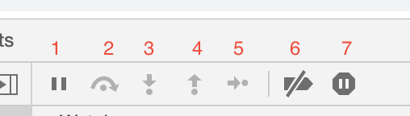

# Chrome Debug #
## Example ##
  
1. 图一表示逐过程执行
```
  至少打下两个断点，使用情况：当我们遇到有那种引入的包的时候，我们可以打下两个断点，在断点跳到使用包里的函数的时候，这个时候我们可以点击该按钮，可以直接跳至第二个断点。不需要进入别人的包里的内容。
 ```
2. 图二表示逐语句执行
```
  打下一个断点之后，根据从这个断点开始一次执行语句
```
3. 图三表示单步进入函数执行
4. 图四表示跳出函数执行